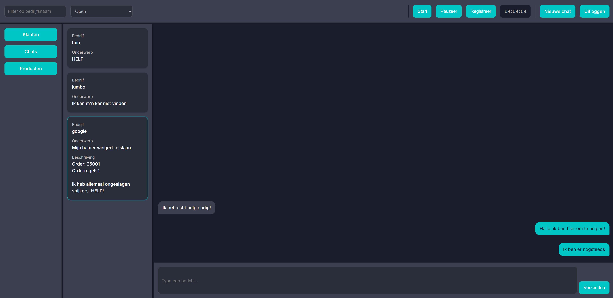

# CNCware Serviceportaal

Een webapplicatie voor het beheren van tickets en het registreren van tijd, gekoppeld aan de Teamleader API. Gebruikers kunnen inloggen, een chat starten, en supportminuten automatisch laten bijwerken op basis van tijdregistratie.

---



---

## ⚙️ Benodigdheden

- Node.js (v18+ aanbevolen)
- NPM (meegeleverd met Node)
- Teamleader OAuth-client (client_id + client_secret)
- `.env` bestand in de map teamleader-backend/ met de volgende inhoud:

```env
CLIENT_ID=a5cdf7c2de14f56a752a9d219c653edb
CLIENT_SECRET=7ee2f1d0b3568620541fd4923eab1e68
REDIRECT_URI=http://localhost:3001/auth/callback
```

Let op: Zorg dat dit .env bestand zich bevindt in de root van de teamleader-backend map.

---

## 🚀 Installatie-instructies

1. **Clone deze repository**

```bash
git clone https://github.com/thijsdenbutter/cncware-service-portal
cd cncware-serviceportaal
```

2. **Installeer frontend dependencies**

```bash
npm install
```

3. **Start de frontend**

```bash
npm run dev
```

4. **Navigeer naar de backend-map**

```bash
cd teamleader-backend
```

5. **Start de backend**

```bash
node index.js
```

6. **Ga naar de applicatie**

Open je browser en ga naar:  
[http://localhost:5173](http://localhost:5173)

---

## 🔐 Inloggen en registreren

Nadat je naar http://localhost:5173 bent gegaan, klik je op Inloggen. Je wordt dan doorgestuurd naar de Teamleader-omgeving.

Log hier in met de volgende gegevens:

Gebruikersnaam: t.den.butter@novi-education.nl

Wachtwoord: KxdtpCcscw9ZGqV!

Na succesvolle login via Teamleader word je teruggestuurd naar het serviceportaal. Hier kun je vervolgens inloggen of registreren binnen de applicatie.

Bij registratie geldt:

E-mailadres eindigend op @cncware.nl → automatisch adminrol

Alle andere e-mailadressen → normale gebruikersrol


---

## 📌 Opmerking

De applicatie functioneert alleen als de juiste Teamleader OAuth-gegevens beschikbaar zijn. Voor een officiële release is het nodig een backend te ontwikkelen die eigen gebruikersbeheer ondersteunt en losstaat van je persoonlijke Teamleader-account.

